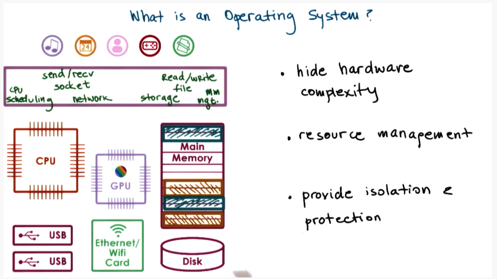

# What is an operating system?

## Simple Definition

a piece of software that: 

- **abstracts** (simplify what hardware looks like)
- **arbitrates** (to control the hardware use) 

the underlying hardware systems

## Shop Manager Metaphor

### A shop manager

- Directs operational resources: use of employee time, parts, tools
- Enforces working policies: fairness, safety, cleanup
- Mitigates difficulty of complex tasks: simplifies operation, optimizes performance

### An operating system

- Directs operational resources: use of CPU, memory, peripheral devices
- Enforces working policies: fair resource access, limits to resource usage
- Mitigates difficulty of complex tasks: abstract hardware details (system calls)

## What is OS?

Let's first look at the hardware of a computing system. This computing system consists of:

- Central Processing Unit (CPU)
- Physical Memory
- Network Interfaces (Ethernet/Wifi Card)
- GPU
- Storage Devices (Disk, Flash drives [USB])

In addition, a computing system can have higher level applications. These are the "programs" that we use every day on our computer:

- Skype
- Word
- Chrome

The Operating System is the layer of software that sits **between** the hardware components and the higher level applications.

### Main Functions of an Operating System

1.  Hide hardware complexity. 
    The operating system provides a higher level abstraction, the file, with a number of operations - like read and write - which applications can interact with.

2.  manages underlying hardware resources.  
    Operating system allocates memory for applications, schedules them for execution on the CPU, controls access to various network devices and so on.

3.  Provides isolation and protection. 
    When applications are running concurrently, the operation system has to ensure that they can do what they need to without hurting one another. For example, memory allocated to each application must not be readable/writable from another application.

## Operating System Definition

An operating system is a layer of systems software that:

- directly has privileged access to the underlying hardware
- hide the hardware complexity
- manages hardware on behalf of one or more applications according to some predefined policies.
- Ensures that applications are isolated and protected from one another

## Operating System Examples

Certain operating systems may target:

- desktop environment
- embedded environment
- a mainframe or a server environment

We will focus on operating systems for desktop environments and embedded environments.

For desktop operating systems we have:

- Microsoft Windows
- Unix-based
  - Mac OSX (BSD)
  - Linux (Ubuntu, Centos, Fedora)

For embedded operating systems:

- Android
- iOS
- Symbian

## OS Elements

To achieve its goals, an operating systems provides:

1. High level **abstractions**
2. **mechanisms** to operate on these abstractions.
3. **Policies** (how mechanisms will be used)

### Examples of abstractions

- application abstractions: process, thread
- hardware abstractions: file, socket, memory page

### Corresponding mechanisms

- create/schedule
- open/write/allocate

### Policies (how mechanisms will be used)

- least-recently used (LRU)
- earliest deadline first (EDF)

## OS Elements Example

Let's look at an example of memory management.

The main abstraction here is the memory page, which corresponds to some addressable region of memory of some fixed size.

The operating system integrates mechanisms to operate on that page like allocate, which actually allocates the memory in DRAM. It can also map that page into the address space of the process, so that the process can interact with the underlying DRAM.

Over time, the page may be moved to different spaces of memory, or may be moved to disk, but those who use the page abstraction don't have to worry about those details. That's the point of the abstraction.

How do we determine when to move the page from DRAM to disk? This is an example of a policy, and one such implementation of that policy would use the least-recently-used (LRU) algorithm, moving pages that have been accessed longest ago onto disk.
