# Simple Process Definition

Instance of an executing program

Synonymous with **task** or **job**

# Toy Shop Metaphor

## An order of toys

- state of execution: completed toys, waiting to be built
- parts and temporary holding area: plastic pieces, containers
- may require special hardware: sewing machine, glue gun

## A process:

- state of execution: program counter, stack
- parts and temporary holding area: data, register state occupies state in memory
- may require special hardware: I/O devices

# What is Process

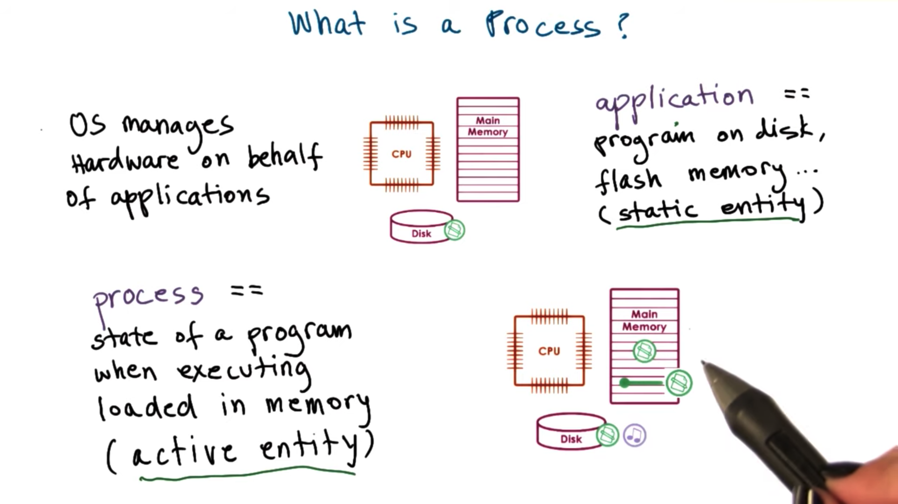

Operating system manages the hardware on behalf of **applications**

**Application** is a static entity which stored on disk

**Process** is launched application. It is loaded into memory and executed. A process is an active entity.

If the same program is launched more than once, multiple processes will be created. They will have the same instructions, but very different state.

# What Does a Process Look Like?

A process encapsulates all of the state of a running application. Every element of the process state has to be uniquely identified by its address.

An operating system abstraction used to encapsulate all of the process state is an **address space**

The address space is defined by a range of addresses V_0 to V_max. Different types of process state will appear in different regions of the address space.

Different types of process state in an address space

- The code
- The data available when process is first initialized (static state)
- Heap: Dynamically created state (what we create)

  Seems contiguous but there are holes filled with garbage (think of C struct not memset)

- Stack: Dynamically created state that grows and shrinks are the program executes LIFO Stack frames added and removed as functions are called and return

# Process Address Space

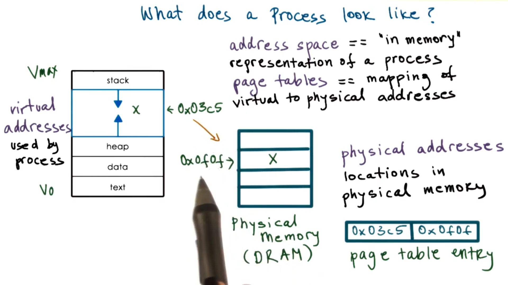

## Virtual Addresses

Potential range of addresses in process address space go from V_0 to V_max

Memory management hardware and components of the operating system maintain a mapping (**Page Table**) between virtual memory addresses and physical memory addresses. By using this mapping, we can _decouple_ the layout of the data in the virtual address space from the layout of the data in physical memory.

# Address Space and Memory Management

We may not have enough physical memory to store all a process's state even if we do need it. To deal with this overflow, the operating system decides dynamically which portion of the process's address space will live in physical memory and which portion will be swapped temporarily to disk.

Process share physical addresses sometimes. But operating system must check the validity of memory accesses to make sure that, say, process A isn't trying to write to memory mapped to by process B.

# Process Execution State

### program counter

Current executing line within a program

### CPU registers

The program counter as well as other data related to a current process's state are stored on CPU registers.

### Stack pointer

The top of process's stack

## process control block

To maintain all of this useful information for every single process

# Process Control Block

A process control block is a data structure that the operating system maintains for every process that it manages.

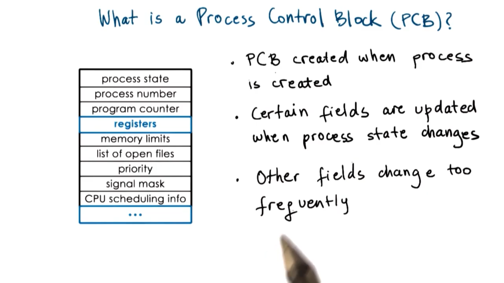

The PCB is created and initialized when the process is initially created.

Certain fields of the PCB may changed when process state changes.

- virtual / physical memory

Some fields can change often, like the **program counter**

- Stored within CPU registers (no update PCB every time)

- Save it to the PCB when the process is no longer running

# How is PCB Used

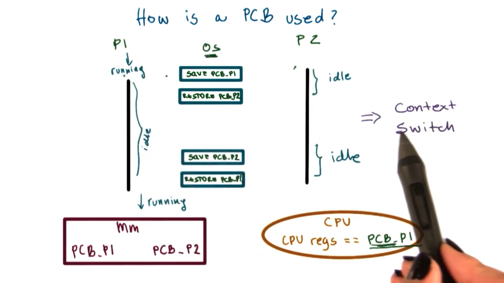

PCBs are stored in memory on behalf of a process by the operating system until it comes time for the process to start/resume execution. At that point, the process's PCB is loaded from memory into CPU registers, at which point instruction execution can begin.

If a process is interrupted by the operating system - perhaps to give another process some CPU time - the operating system must pull the PCB out of CPU registers and save it back into memory.

Each time the operating system switches between processes, we call this a **context switch**

# Context Switch

A mechanism used by the operating system to switch from the context of one process to the context of another process.

It is very **EXPENSIVE** so we want to limit how often we context switch

## Direct costs

number of CPU cycles required to load and store a new PCB to and from memory

## Indirect costs

When a process is running on the CPU a lot of its data is stored in the processor cache.

Accessing data from cache is faster than accessing from memory.

When we data we need is present in the cache, we say that the cache is **hot**. When a process gets swapped out, all of it's data is cleared from cache. The next time it is swapped in, the cache is **cold**.

# Process Life Cycle: States

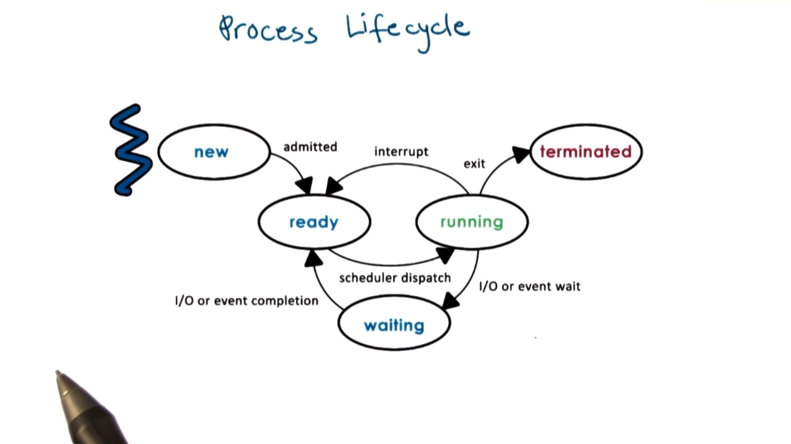

# Process Life Cycle: Creation

In operation systems, a process can create one or more child processes.

Once the operating system is done booting, it will create some root processes. These processes have privileged access.

Most operating systems support two mechanisms for process creation:

- fork

- exec

With fork, the operating system will create a new PCB for the child, and then will copy the exact same values from the parent PCB into the child PCB. The result is that both processes will continue executing with the exact same state at the instruction immediately following the fork (they have the same program counter).

With exec, the operating system will take a PCB (created via fork), but will not leave the values to match those of the parents. Instead operating system loads a new program, and the child's PCB will now point to values that describe this new program. The program counter of the child will now point to the first instruction of the new program.

For **creating** a new program, you have to call fork to get a new process, and then call exec to load that program's information into the child's PCB.

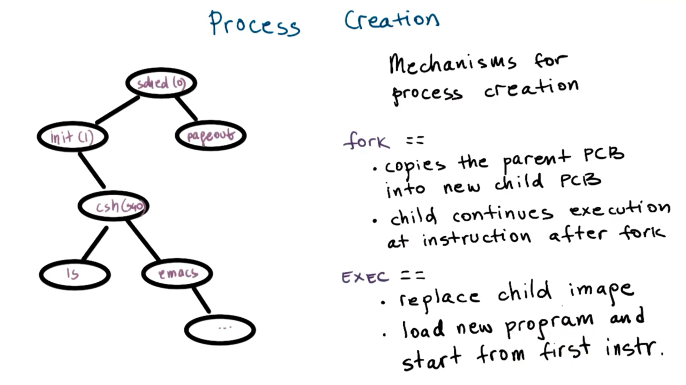

# Role of the CPU scheduler

The CPU scheduler manages how processes use the CPU resources.

It determines which process will use the CPU next, and how long that process has to run.

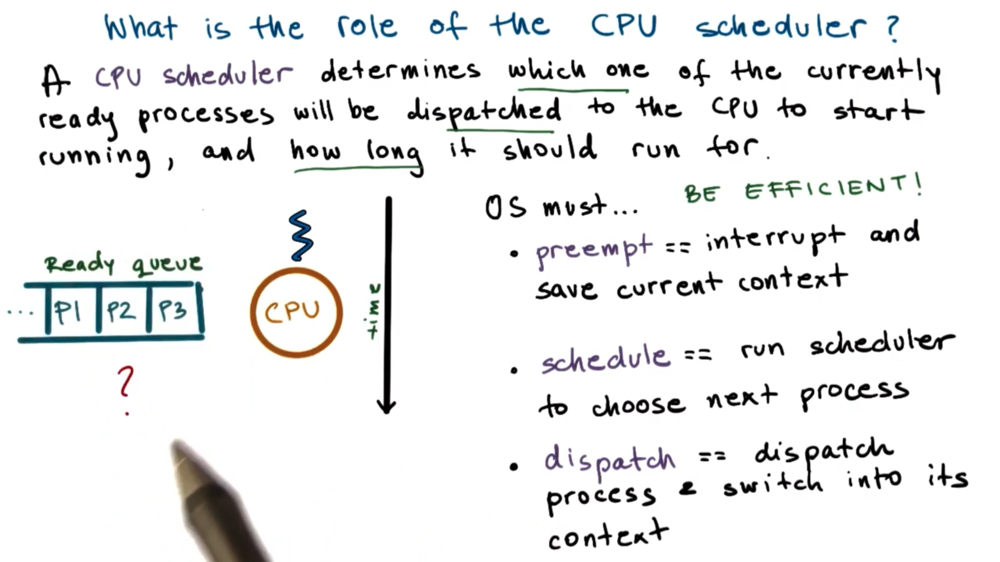

Since CPU resources are precious, the operating system needs to make sure that it spends the bulk of its time running processes, NOT making scheduling decisions.

# Length of Process

We can calculate a measure of CPU efficiency by looking at the amount of time spent executing a process divided by the total amount of computation time.

For example, if the number of blocks of time spent scheduling equals the number of blocks spent executing, and the length of an execution block is the same as the length of a scheduling block, then the CPU efficiency is only 50%!

On the other hand, if the same number of blocks are spent scheduling as are spent executing, but the process runs for 10 times the length of the scheduling block, the efficiency increases to over 90%!

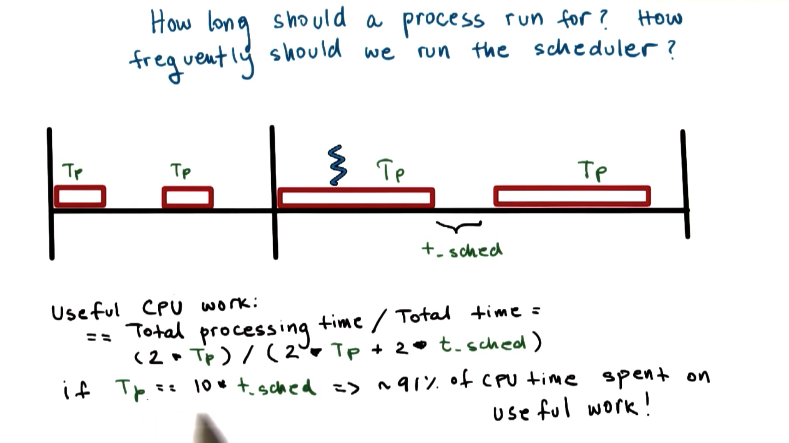

The amount of time that has been allocated to a process that is scheduled to run is known as a timeslice.

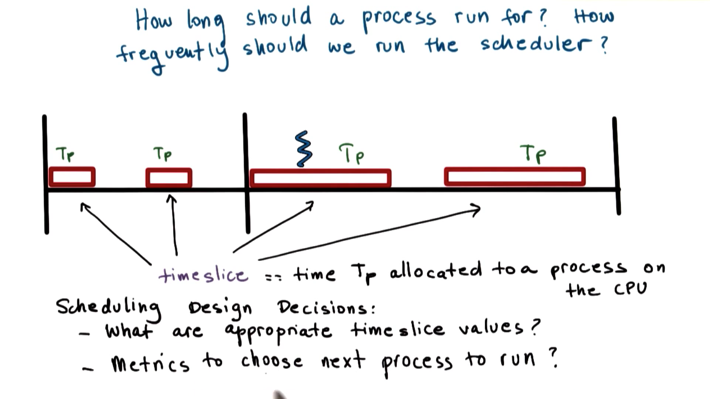

When designing a scheduler, we have to make important design decisions:

- What are appropriate timeslice values?

- What criteria is used to decide which process is the next to run?

# What about I/O

When a process makes an I/O request, the operating system will deliver that request, and move the process to the I/O queue for that particular I/O device. The process will remain in the queue until the request is responded to, after which the process will move back to a ready state (or might immediately be scheduled on the CPU).

Processes can end up on the ready queue in a few ways.

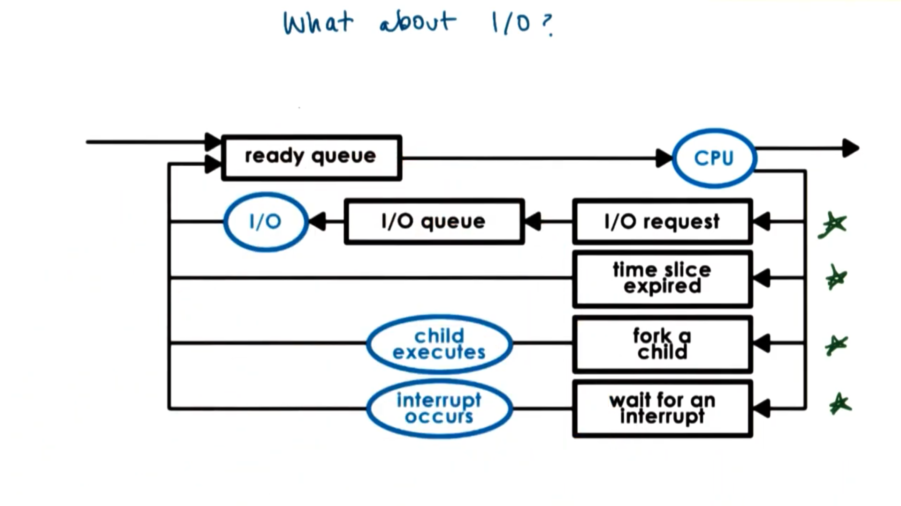

# Inter Process Communication

- transfer data/information between address spaces

- maintaining protection and isolation

- be flexible and performant

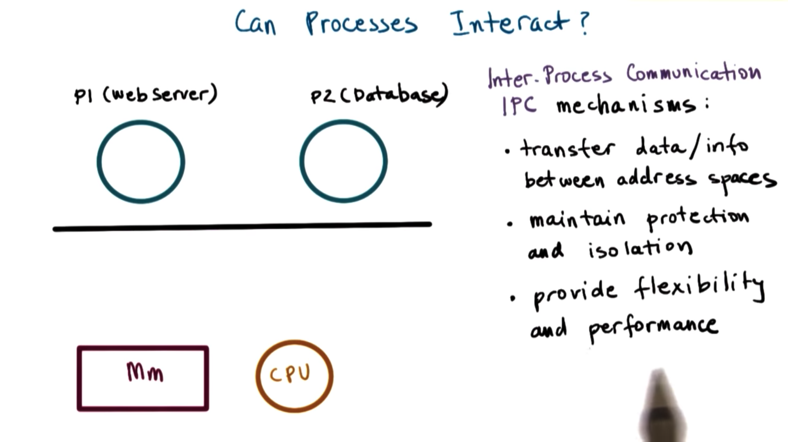

## Message Passing IPC

Operating system establishes a communication channel - like a shared buffer, for instance - and the processes use that to communicate. One process can write/send through the channel, while the other can read/recv from the channel.

Benefits of this approach is that the operating system will manage this channel, and already has the system calls in place for write/send and read/recv.

Downsides are overhead. Every single piece of information to be transmitted needs to be copied from address space of sending process into memory allocated to the kernel, and then finally into the address space of the receiving process.

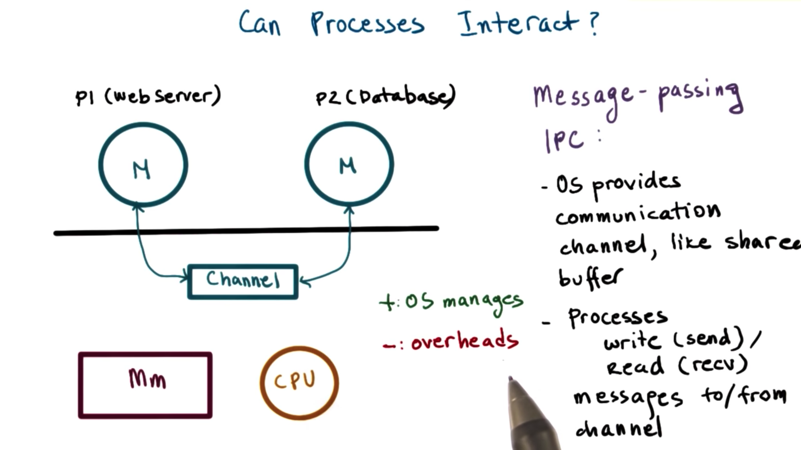

## Shared Memory IPC

The operating system establishes a shared memory channel, and then maps it into the address space of both processes. The processes are then allowed to directly read/write to this memory the same way they can read/write from any memory allocated them in their address space.

The operating system is completely out of the picture in this case, which is the main benefit! No overhead to incur.

The disadvantage to this approach is that because the OS is out of the way, a lot of the APIs that were taken for granted in message passing IPC have to be reimplemented.

