# Process vs. Thread

Threads represent multiple independent execution contexts within the same address space

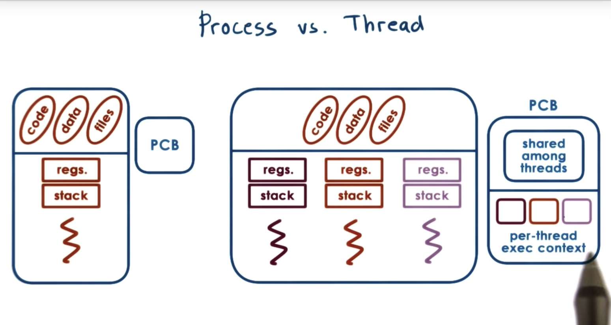

A multithreaded process will have a more complex process control block structure, as these thread specific execution contexts needs to be incorporated.

# Benefits of Multithreading

1. Different threads can work in parallel on different components of the program's workload, which speeds up the program's execution.

   - For example, each thread may be processing a different component of the program's input.

2. Specialization

   If we designate certain threads to accomplish only certain tasks or certain types of task, we can take a specialized approach with how we choose to manage those threads. For instance, we can give higher priority to tasks that handle more important tasks or service higher paying customers.

   Performance of a thread depends on how much information can be stored in the processor cache. By having threads that are more specialized - that work on small subtasks within the main application - we can potentially have each thread keep it's entire state within the processor cache (hot cache), further enhancing the speed at the thread continuously performs it task.

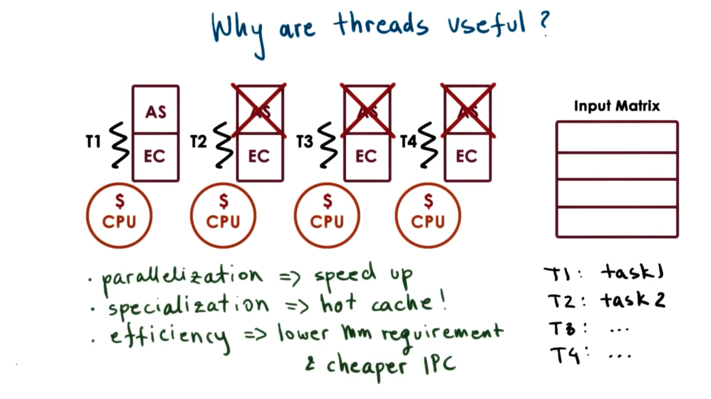

## Why not just write a multiprocess application?

A multiprocess application requires a new address space for each process, while a multithreaded application requires only one address space

As a result, a multithreaded application is more likely to fit in memory, and not requires as many swaps from disk, which is another performance improvement.

As well, passing data between processes - inter process communication (IPC) - is more costly than inter thread communication, which consists primarily of reading/writing shared variables.

# Benefits of Multithreading: Single CPU

Consider the situation where a single thread makes a disk request. The disk needs some amount of time to respond to the request, during which the thread cannot do anything useful. If the time that the thread spends waiting greatly exceeds the time it takes to context switch (twice), then it makes sense to switch over to a new thread.

Now, this is true for both processes and threads. One of the most time consuming parts of context switching for processes is setting up the virtual to physical mappings. Thankfully, when we are context switching with threads, we are using the same mappings because we are within the same process. This brings down the total time to context switch, which brings up the number of opportunities in which switching threads can be useful.

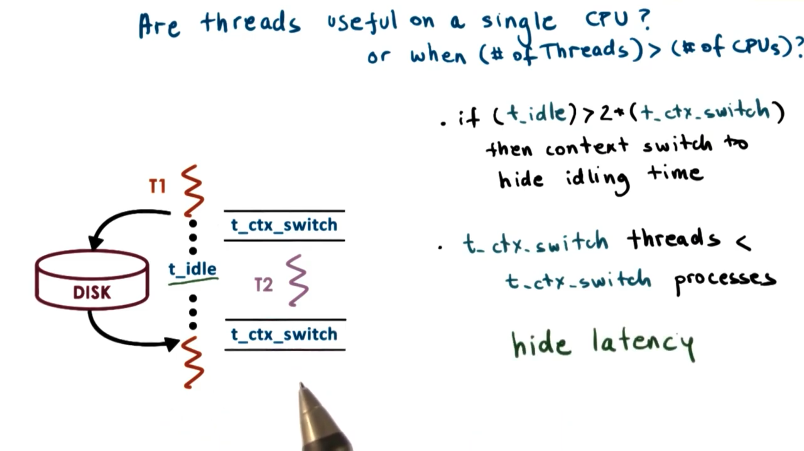

# Benefits of Multithreading: Apps and OS Code

By multithreading the operating system kernel, we allow the operating system to support multiple execution contexts, which is particularly useful when we do have multiple CPUs, which allows the execution contexts to operate concurrently. The OS threads may run on behalf of different application or OS-level services like daemons and device drivers.

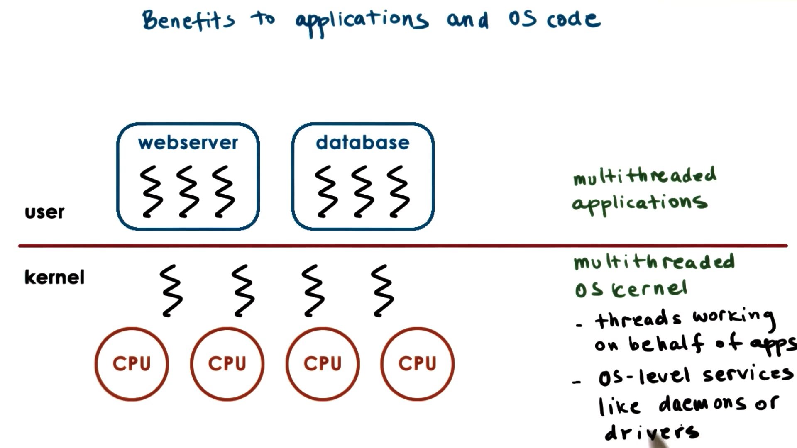

<br>

# Basic Thread Mechanisms


When processes run concurrently, they operate within their own address space

Threads share the same virtual to physical address mappings, since they share the same address space. Naturally, this can introduce some problems. For example, one thread can try to read the data while another modifies it, which can lead to inconsistencies. This is an example of a data race problem.

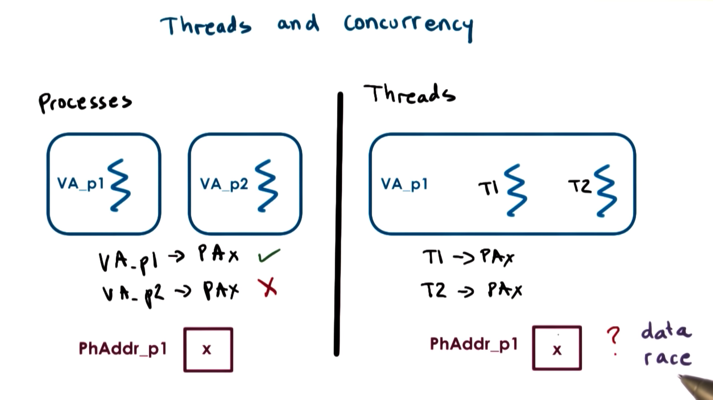

## mutual exclusion

A mechanism that allows threads to operate on data in an exclusive manner

Only one thread at a time is granted access to some data. The remaining threads must wait their turn

We accomplish mutual exclusion through the use of a **mutex**

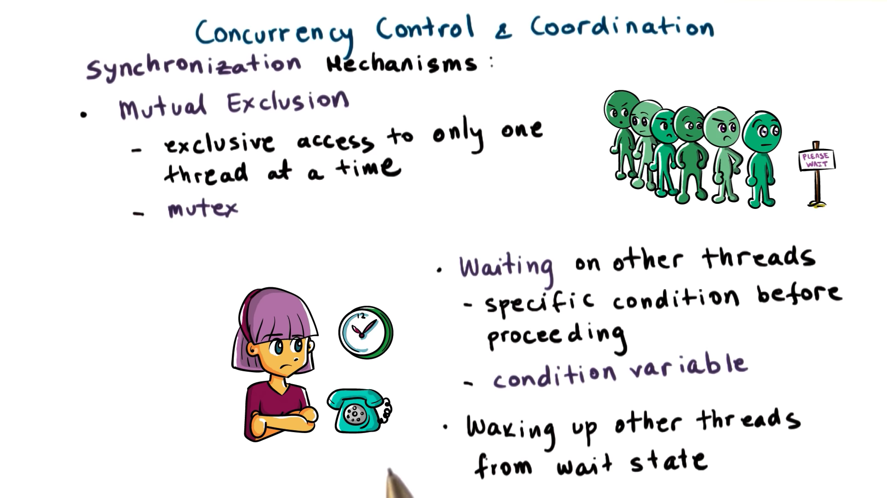

## Condition Variable

Inter thread communication

A thread can wait on another thread, and to be able to exactly specify what condition the thread is waiting on

Both _mutexes_ and _condition variables_ are examples of **synchronization mechanisms**

# Thread Creation

We need some data structure to represent a thread

- Thread ID
- Program counter
- Stack pointer
- Register values
- Stack
- Other attributes

## fork

- not the UNIX fork call
- takes two arguments
  - proc (run when the thread is created)
  - args (pass to proc)

## join

- Return its result or communicate its status to the forking thread

- Ensure that a forking thread doesn't not exit before its forked thread completes work (as child threads exit when parent threads do)

- When **join** returns, the child thread exits the system and all resources associated with it are deallocated


# Thread Creation Example

## data race

As we do not know which thread will run at which time in this example, we cannot be certain of the ordering of the elements in the list

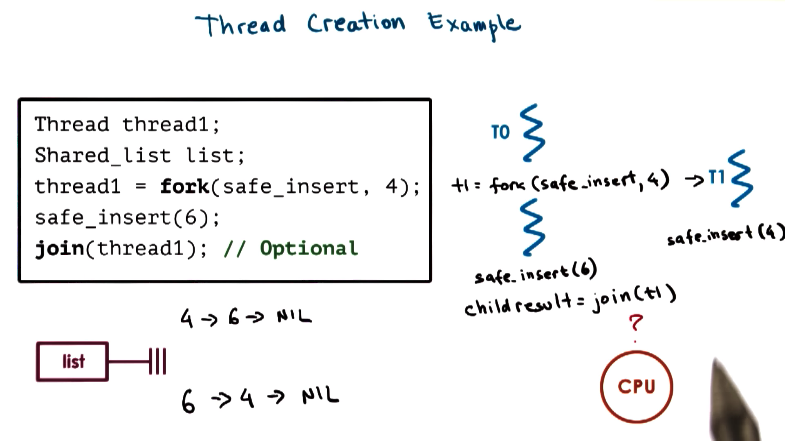

# Mutexes

Many steps required to add an element to the list. Expected behavior is as following:

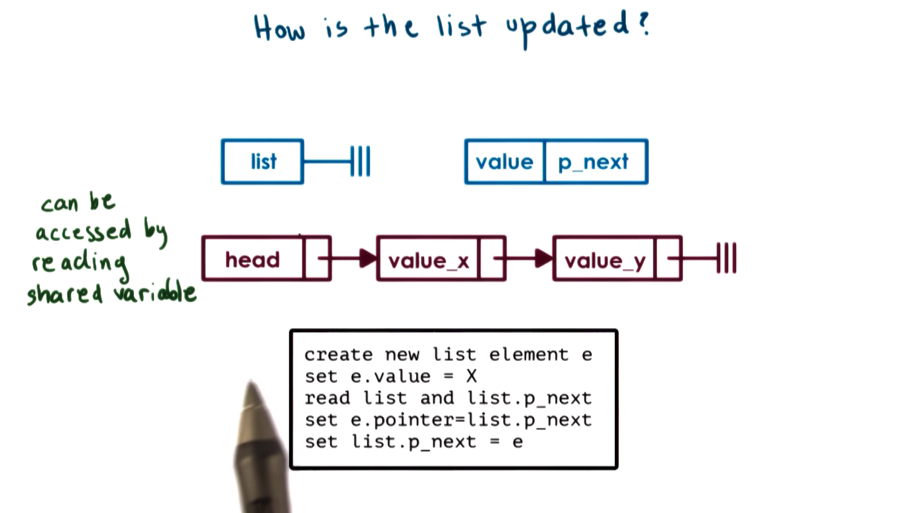

But there might be problem as data race. One example:

1. Thread A reads list and list.p_next
2. Thread B reads list and list.p_next
3. Thread A sets e.pointer to list.p_next
4. Thread B sets e.pointer to list.p_next
5. Thread A sets list.p_next to e
6. Thread B sets list.p_next to e

So one thread add successfully but another lost

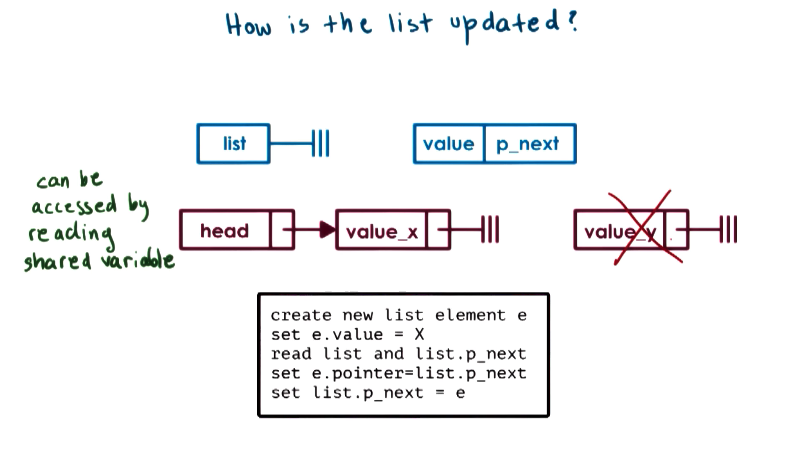

# Mutual Exclusion

## Mutex

A mutex is like a lock

Use when access data/state that is shared among threads

When a thread locks a mutex, it has exclusive access to the shared resource. Other threads will be blocked on the lock operation and can't proceed until the **mutex owner** releases the mutex

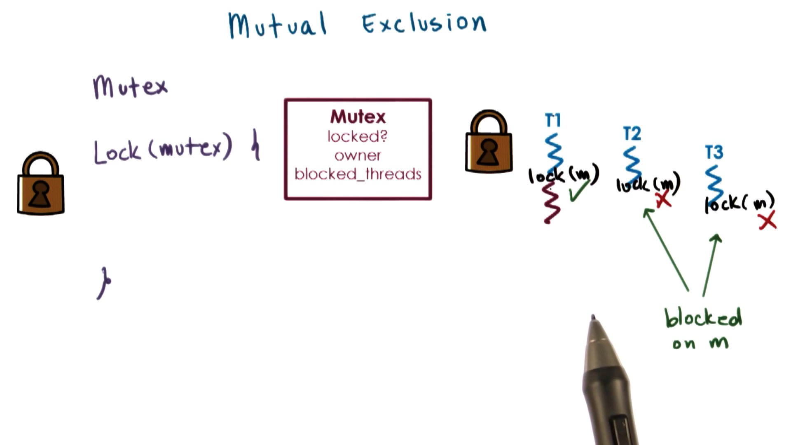

## Data Structure

mutex should have at least the following information:

- lock status
- owner
- blocked threads

## Critical Section

The portion of the code protected by the mutex

Contain code that would necessitate restricting access to one thread at a time: commonly, providing read/write access to a shared variable

Only be executed by one thread at a given moment in time

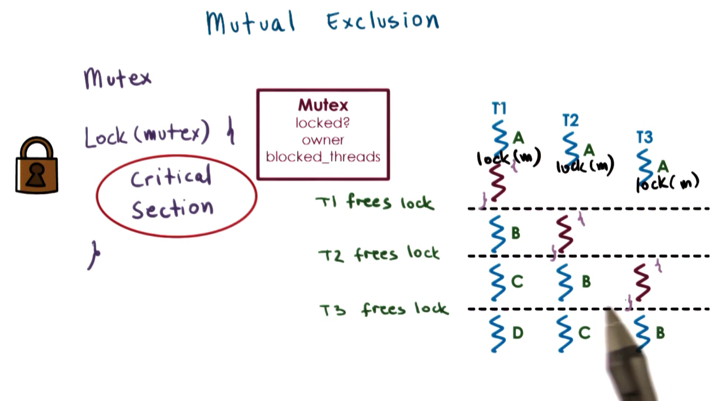

## Unlock Mutex

In two ways:

- the end of a clause following a lock statement is reached
- an unlock function is explicitly called

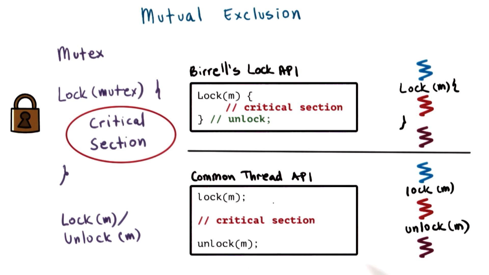

# Mutex Example

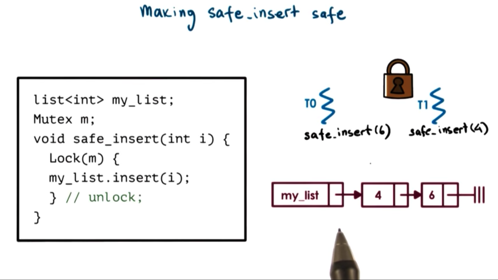

# Producer and Consumer Example

Mutual exclusion is a binary operation

What if the processing you wish to perform with mutual exclusion needs to occur only under certain **conditions**?

## Example

- several producer threads adding values to a list

- one consumer thread that needs to wait until list is full

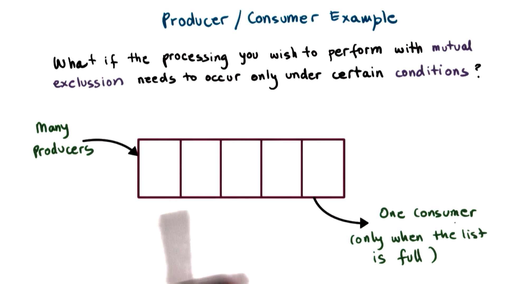

## Mutex solution

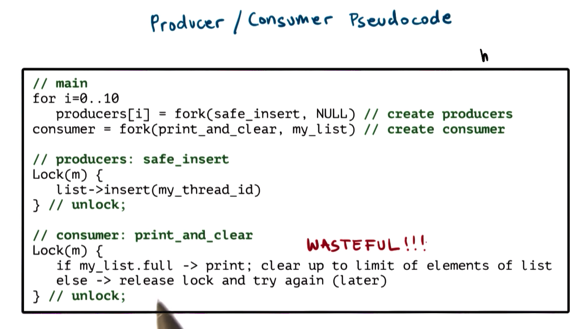

Ideally we wouldn't want our consumer thread to loop but rather our producers to be able to notify the consumer when the list is full

# Condition Variables

A construct that can be used in conjunction with **mutexes** to control the execution of concurrent threads

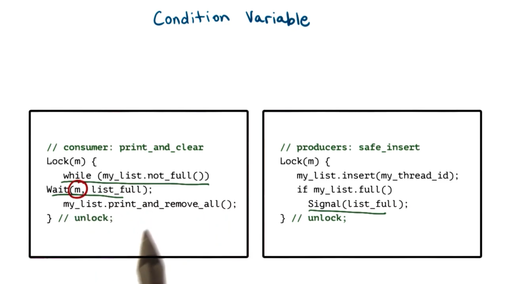

When a consumer sees that it must wait, it makes a call to **the wait function**

## Wait Function

- Ensure that the mutex is released if the condition is not met

- Ensure that mutex is re-acquired when the condition is met

When the condition becomes true, a thread holding the mutex may call the signal function to alert a waiting thread that they may proceed

# Condition Variable API

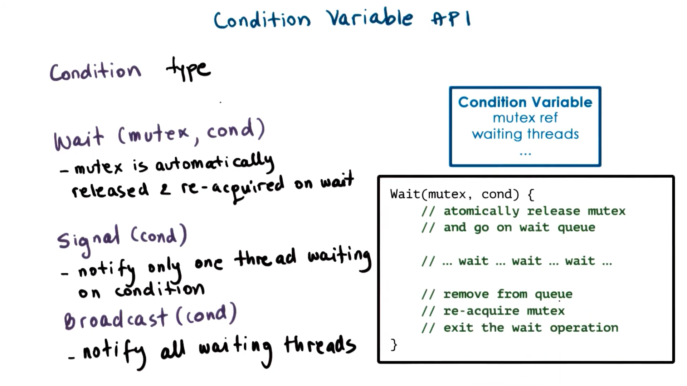

## Condition Variable

should contain

- mutex reference
- list of waiting threads

## Wait Procedure

### Parameters

- mutex
- condition variable

### Implementation

```c
Wait(mutex, cond){
  // atomically release mutex and place thread on wait queue

  // wait wait wait

  // remove thread from wait queue
  // reacquire mutex
  // exit wait
}
```

## Signal Procedure

signal to another thread waiting on a condition that the condition has been met

## Broadcast Procedure

Signal to all other threads waiting on a condition that the condition has been met

Not always be useful. We immediately lock the mutex when removing a thread from the wait queue, we can still only execute one thread at a time

# Readers/Writer Problem

**0 or more readers** can access the shared state

**0 or 1 writers** can access the shared state

## Mutex Solution

too restrictive. Since mutexes only allow **one** thread at time while **multiple** readers can get access to state concurrently.

## Conditions

#### read_counter == 0 && write_counter == 0

both writing and reading is allowed

#### read_counter > 0

reading is allowed

#### write_counter == 1

neither reading nor writing is allowed

## State of Resource

**free** - resource_counter = 0
**reading** - resource_counter > 0
**writing** - resource_counter = -1

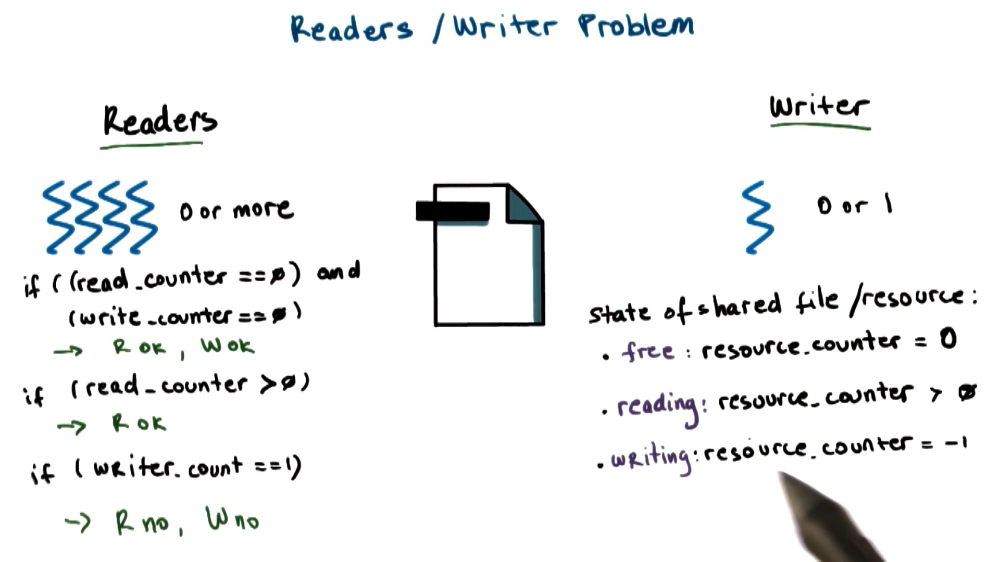

# Readers/Writer Example

## Data

### resource_counter

a proxy variable for the state of the shared resource

### counter_mutex

a mutex which controls access to resource_counter

### read_phase

a condition variable signifying that the resource is ready for reading

### write_phase

a condition variable signifying that the resource is ready for writing

## Implementation


## Explanation

Readers begin reading by first locking the mutex and incrementing the value of the **resource_counter**

Once the reader decrements **resource_counter**, it will check to see if **resource_counter** is zero. If so, this final reader will signal on the **write_phase** variable to wake up a waiting writer.

After re-acquired mutrex, We need to **recheck** our condition in while loop because the act of **removing** the thread from the wait queue and **reacquiring** the mutex occur as two separate procedures. This means that the mutex could be reacquired in between these two steps by a different thread, with resource_counter being updated by that thread.

Multiple threads cannot access the mutex concurrently. But, after each thread accesses the mutex in turn, all readers can read from the shared state concurrently

Even though we call broadcast before signal we don't really have control over whether a waiting reader or writer will be woken up first

# Critical Section Structure

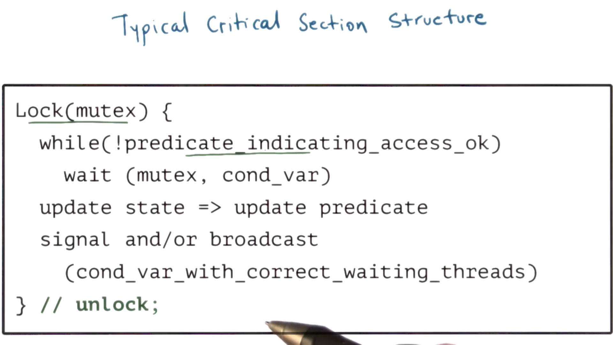

Critical section for above example is **read and write data part**

Even though the critical operations are not governed by a mutex, entering and exiting from those operations is

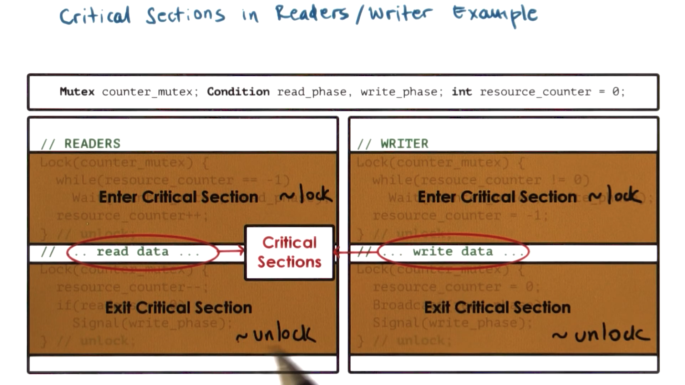

# Critical Section Structure With Proxy

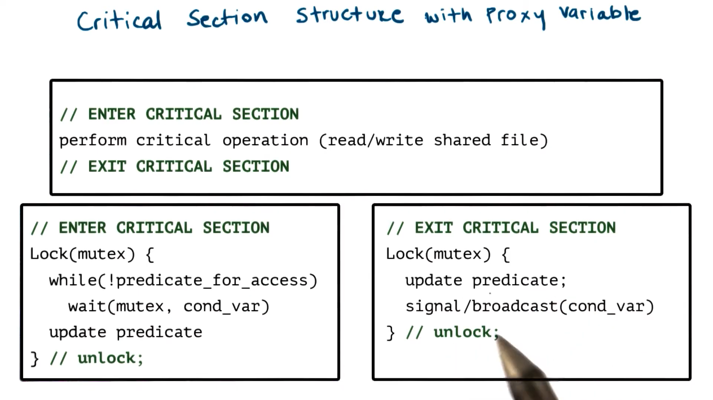

Only one thread can get access to mutex to update proxy, but multiple thread can execute critical section concurretly

# Common Pitfalls

Make sure to keep track of the mutex/condition variables that are used with a given shared resource.

Make sure to always use lock or unlock

Don't use different mutexes to access a single resource. Using different mutexes to access a resource is akin to just not using a mutex at all, since there is no mutual exclusion amongst different mutexes

Make sure that you are signaling or broadcasting on the correct condition

Make sure to not use signal when broadcast needs to be used. The opposite is actually okay

The order of execution of threads is not related to the order in which we call signals or broadcasts.

# Spurious Wake-ups

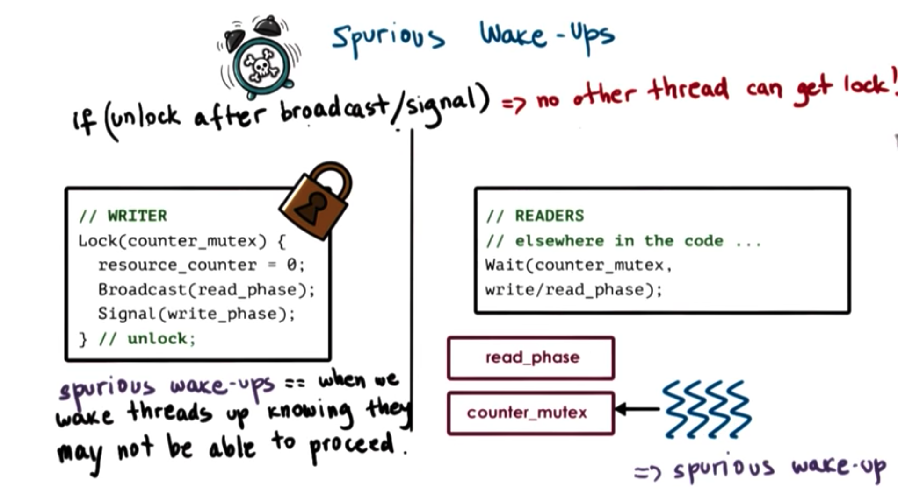

Reader threads will have been woken up from one queue **(associated with the condition variable)** only to be placed on another queue **(associated with acquiring the mutex)**

Spurious wake ups will not affect the correctness of the program, but rather the performance, as cycles will be wasted context switching to threads that will just be placed back on another queue

## Fix Solution

Often we can unlock the mutex before we signal or broadcast. Sometimes we cannot.

Wether signal/broadcast conditionally depending on shared state which must be accessed from within the mutex

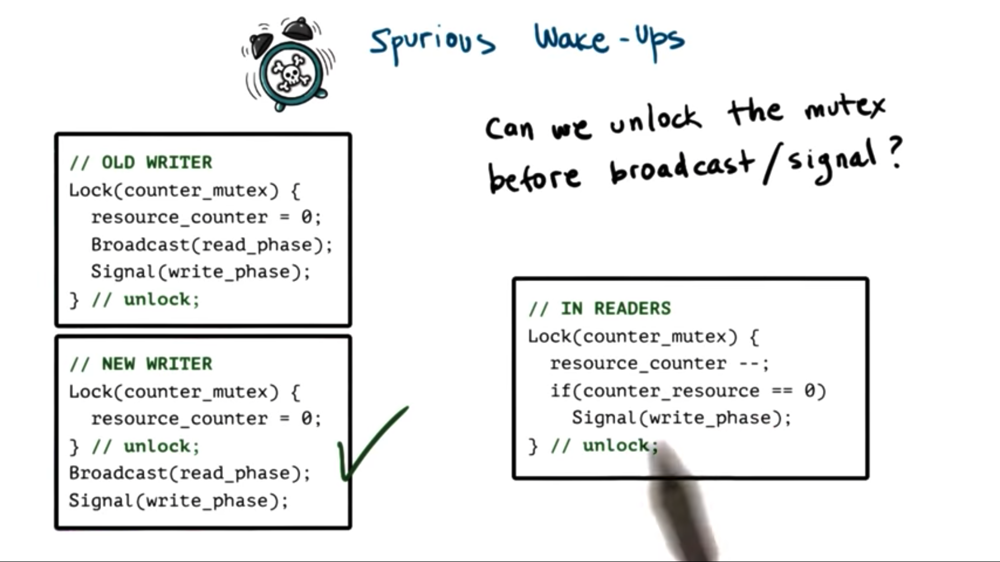

# Deadlocks

A deadlock occurs when two or more competing threads are waiting on each other to complete, but none of them ever do.

Let's consider two threads, T1 and T2, that need to perform operations on some shared variables A and B. Before performing these operations, each thread must lock the mutex associated with those variables, because they are part of shared state.

Let's assume that T1 first locks the mutex for A and then locks the mutex for B before performing the operation. Let's assume that T2 first locks the mutex for B and then locks the mutex for A, before performing the operation.

This is where the problem lies. T2 will not be able to lock the mutex for A, because T1 is holding it. T1 will not be able to lock the mutex for B, because T1 is holding it. More importantly, neither T1 nor T2 will be able to release the mutex that the other needs, since they are both blocking trying to acquire the mutex the other has.

How can we avoid these situations?

One solution would be to unlock A before locking B. However, this solution will not work in this scenario since we need access to both A and B.

Another solution would be to get all locks up front, and then release all of them at the end. This solution may work for some applications, but may be too restrictive for others, because it limits the amount of parallelism that can exist in the system.

The last and most ideal solution is to maintain a lock order. In this case, we would enforce that all threads must lock the mutex associated with A before locking the mutex associated with B, or vice versa. The particular order may not be important, but rather the enforcement of that ordering within the application is paramount.

A cycle in the wait graph is necessary and sufficient for a deadlock to occur, and the edges in this graph are from the thread waiting on a resource to the thread owning a resource.

We can try to prevent deadlocks. Each time a thread is about to acquire a mutex, we can check to see if that operation will cause a deadlock. This can be expensive.

Alternatively, we can try to detect deadlocks and recover from them. We can accomplish this through analysis of the wait graph and trying to determine whether any cycles have occurred. This is still an expensive operation as it requires us to have a rollback strategy in the event that we need to recover.

We can also apply the ostrich algorithm by doing nothing! We can hope that the system never deadlocks, and if we are wrong we can just reboot.

# Kernel Vs. User-Level Threads

Kernel level threads imply that the operating system itself is multithreaded. Kernel level threads are visible to the kernel and are managed by kernel level components like the kernel level scheduler. The operating system scheduler will determine how these threads will be mapped onto the underlying physical CPU(s) and which ones will execute at any given point.

Some kernel level threads may exist to support user level applications, while other kernel level threads may exist just to run operating system level services, like daemons for instance.

At the user level, the processes themselves are multithreaded and these are the user level threads. For a user level thread to actually execute, it must first be associated with a kernel level thread, and then the OS level scheduler must schedule that kernel level thread on the CPU.

# Multithreading Models

We will consider three multithreading models.

## One-to-One Model

In this model, all of the user level threads for a process are mapped onto a single kernel level thread. At the user level, there is a thread management library to makes decisions about which user level thread to map onto the kernel level thread at any given point in time. That user level thread will still only run once that kernel level thread is scheduled on the CPU by the kernel level scheduler.

The benefit of this approach is that it is portable. Everything is done at the user level, which frees us from being reliant on the OS limits and policies. As well, we don't have make system calls for any thread-related decisions.

However, the operating system loses its insight into application needs. It doesn't even know that the process is multithreaded. All it sees is one kernel level thread. If the user level library schedules a thread that performs some blocking operation, the OS will place the associated kernel level thread onto some request queue, which will end up blocking the entire process, even though more work can potentially be done.

## Many-to-Many Model

This model allows for some user threads to have a one-to-many relationship with a kernel thread, while allowing other user threads to have a one-to-one relationship with a kernel thread.

The benefit is that we get the best of both worlds. The kernel is aware that the process is multithreaded since it has assigned multiple kernel level threads to the process. This means that if one kernel level thread blocks on an operation, we can context switch to another, and the process as a whole can proceed.

We can have a situation where a user level thread can be scheduled on any allocated kernel level thread. This is known as an unbound thread. Alternatively, we can have the case where a user level thread will always be scheduled atop the same kernel level thread. This is known as a bound thread.

One of the downsides of this model is that is requires extra coordination between the user- and kernel-level thread managers.

# Scope of Multithreading

At the kernel level, there is system wide thread management, supported by the operating system level thread managers. These managers will look at the entire platform before making decision on how to run its threads. This is the system scope.

On the other hand, at the user level, the user level library that manages all of the threads for the given process it is linked to. The user level library thread managers cannot see threads outside of their process, so we say these managers have process scope.

To understand the consequences of having different scope, let's consider the scenario where we have two processes, A and B. A has twice as many user level threads as B.

If the threads have a process scope, this means that the kernel cannot see them, and will probably allocate equal kernel resources to A and B. This means that a given thread in A will be allocated half of the CPU cycles as will be allocated to a thread in B.

If we have a system scope, the user level threads will be visible at the kernel, so the kernel will allocate the CPU relative to the total amount of user threads, as opposed to the total amount of processes. In the case of A and B, if the threads in these processes have a system scope, A will most likely be allocated twice the number of kernel level threads as B.

[pic]

# Multithreading Patterns

## Boss/Workers Pattern

The boss/workers pattern is characterized by having one boss thread and some number of worker threads. The boss is in charge of assigning work to the workers, and the workers are responsible for completing the entire task that is assigned to them.

The throughput of the system is limited by the boss thread, since the boss has to do some work for every task that comes into the system. As a result it is imperative to keep the boss efficient to keep the overall system moving smoothly. Specifically, the throughput of the system is inversely proportional to the amount of time the boss spends on each task.

How does the boss assign work to the workers? One solution is to keep track of which workers are currently working, and send a direct signal to a worker that is idle. This means that the boss must do for each worker, since it has to select a worker and then wait for that work to accept the work.

The positive of this approach is that the workers do not need to synchronize amongst each other. The downside of this approach is that the boss must keep track of every worker, and this extra work will decrease throughput.

Another option is to establish a queue between the boss and the workers, similar to a producer/consumer queue. In this case, the boss is the sole producer, while the workers are consumers.

The positive of this approach is that the boss doesn't need to know any of the details about the workers. It just places the work it accepts on the queue and moves on. Whenever a worker becomes free it just looks at the front of the queue and retrieves the next item.

The downside of this approach is that further synchronization is required, both for the boss producing to the queue, and the workers competing amongst one another to consume from the queue. Despite this downside, this approach still results in decreased work for the boss for each task, which increases the throughput for the whole system.

### How many workers?

If the work queue fills up, the boss cannot add items to the queue, and the amount of time that the boss has to spend per task increases. The likelihood of the queue filling up is dependent primarily on the number of workers.

Adding more threads may help to increase/stabilize the throughput, but adding an arbitrary number of threads can introduce complexities.

We can create workers on demand; that is, in response to a new task coming into our system. This may be inefficient, though if the cost of creating a worker (thread) is significant.

A more common model is to create a pool of workers that are initialized up front. The questions remains: how do we know how many workers we ought to create?

A common technique is to use a pool of workers that can be increased in response to high demand on the system. This is not quite like the on demand approach in that new threads will not be created one at a time when the demand passes a threshold, but rather the pool may be doubled or increased by some other multiple.

The benefit of the boss/workers model is the overall simplicity. One thread assigns the work, and the rest of the threads complete it.

One downside of this approach is the thread pool management overhead. Another downside is that this system lacks locality. The boss doesn't keep track of what any of the workers were doing last. It is possible that a thread is just finishing a task that is very similar to an incoming task, and therefore may be best suited to complete that task. The boss has no insight into this fact.

### Worker Variants

An alternative to having all the workers in the system perform the same task is to have different workers specialized for different tasks. One added stipulation to this setup is that the boss has to do a little bit more work in determining which set of workers should handle a given task, but this extra work is usually offset by the fact that workers are now more efficient at completing their tasks.

This approach exploits locality. By performing only a subset of the work, it is likely only a subset of the state will need to be accessed, and it is more likely this part of the state will already be present in CPU cache.

In addition, we can offer better quality of service. We can create more threads for urgent tasks or tasks that have higher paying customers.

One downside of this approach is the load balancing mechanisms and requirements may become more difficult to reason about.

## Pipeline Pattern

In a pipeline approach, the overall task is divided into subtasks and each of the subtasks are assigned a different thread. For example, if we have six step process, we will have six kinds of threads, one for each stage in the pipeline.

At any given point in time, we may have multiple tasks being worked on concurrently in the system. For example, we can one have task currently at stage one of completion, two tasks at stage two, and so forth.

The throughput of the pipeline will be dependent on the weakest link in the pipeline; that is, the task that takes the longest amount of time to complete. In this case, we can allocate more threads to that given step. For example, if a step takes three times as long as every other step, we can allocate three times the number of threads to that step.

The best way to pass work between these stages is a shared buffer base communication between stages. That means the thread for stage one will put its completed work on a buffer that the thread from stage two will read from and so on.

[pic]

In summary, a pipeline is a sequence of stages, where a thread performs a stage in the pipeline, which is equivalent to some subtask within the end to end processing. To keep the pipeline balanced, a stage can be executed by more than one thread. Communication via shared buffers reduces coupling between the components of the system.

A key benefit of this approach is specialization and locality, which can lead to more efficiency, as state required for subsequent similar jobs is likely to be present in CPU caches.

A downside of this approach is that it is difficult to keep the pipeline balanced over time. When the input rate changes, or the resources at a given stage are exhausted, rebalancing may be required.

## Layered Pattern

A layered model of multithreading is one in which similar subtasks are grouped together into a "layer" and the threads that are assigned to a layer can perform any of the subtasks in that layer. The end-to-end task must pass through all the layers.

A benefit of this approach is that we can have specialization while being less fine-grained than the pipeline pattern.

Downsides of this approach include that it may not be suitable for all applications and that synchronization may be more complex as each layer must know about the layers above and below it to both receive inputs and pass results.

[pic]
