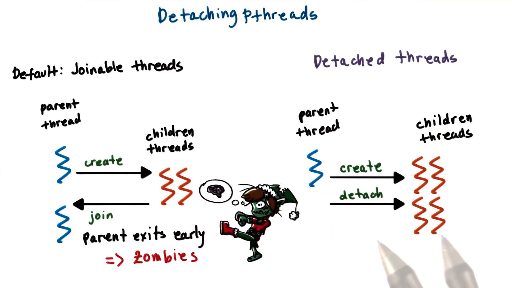
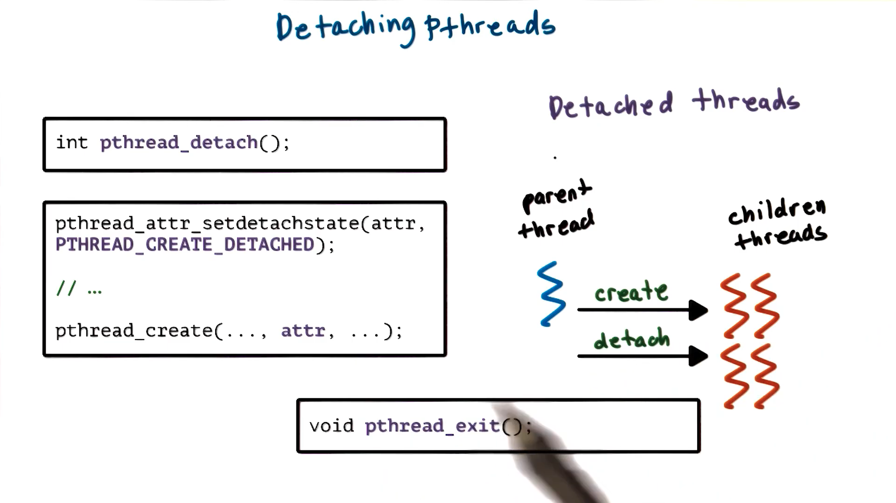
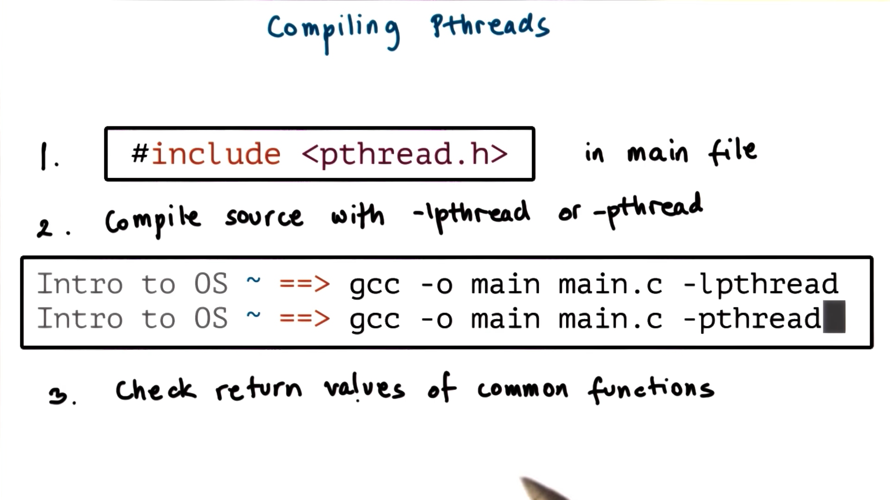

# PThread Creation

**pthread_t** - data type to represent threads

**pthread_attr_t** - set various options on the thread during creation

## Create Thread


```c
int pthread_create(pthread_t *thread, const pthread_attr_t *attr, void * (*start_routine)(void *), void *arg);
```

return value is whether the creation was a success or a failure.

## Thread Join

Child threads can be joined back to a parent thread with

```c
int pthread_join(pthread_t thread, void **status);
```

return value is whether the join was a success or a failure.

## Thread Attribute


### Data Structure

The **pthread_attr_t** data structure allows us to define features of the new thread we are creating, such as:

- stack size
- scheduling policy
- priority
- system/process scope
- inheritance
- joinable

### Pass As Null

If **NULL** is passed in the place of a **pthread_attr_t**, pthreads falls back to default behavior for the new thread.

### Operations

#### allocate and deallocate space

```c
int pthread_attr_init(pthread_attr_t *attr);
int pthread_attr_destroy(pthread_attr_t *attr);
```

#### set/get various attributes of that structure

```c
pthread_attr_{set/get}{attribute};
```

## Detachable Threads


In pthreads, the default behavior for thread creation is joinable threads. For a joinable (child) thread, the parent will not terminate until the child has completed their execution.

### Zombies Thread


Parent thread exits early

### Detached Thread



Detached threads cannot be joined back into the parent, allowing the parent to exit early and the child threads to continue their execution.

To detach threads, use

```c
int pthread_detach(pthread_t thread);
```

or

```c
pthread_attr_setdetachstate(attr, PTHREAD_CREATE_DETACHED);

// ...

pthread_create(..., attr, ...);
```

Since parent threads do not need to wait around until child threads complete, they can simply exit with **pthread_exit**

# Compiling PThreads



# PThread Creation Example 1

```c
#include <stdio.h>
#include <pthread.h>
#define NUM_THREADS 4

void *hello(void *args)
{
    /* thread main */
    printf("Hello Thread \n");
    return 0;
}

int main(void)
{
    int i;
    pthread_t tid[NUM_THREADS];
    for (int i = 0; i < NUM_THREADS; i++)
    {
        /* create/fork threads */
        pthread_create(&tid[i], NULL, hello, NULL);
    }
    for (int i = 0; i < NUM_THREADS; i++)
    {
        /* wait/join threads */
        pthread_join(tid[i], NULL);
    }

    return 0;
}
```

# PThread Creation Example 2

```c
#include <stdio.h>
#include <pthread.h>
#define NUM_THREADS 4

void *threadFunc(void *pArg)
{
    /* thread main */
    int *p = (int *)pArg;
    int myNum = *p;
    printf("Thread number %d\n", myNum);
    return 0;
}

int main(void)
{
    int i;
    pthread_t tid[NUM_THREADS];
    for (i = 0; i < NUM_THREADS; i++)
    {
        pthread_create(&tid[i], NULL, threadFunc, &i);
    }
    for (i = 0; i < NUM_THREADS; i++)
    {
        pthread_join(tid[i], NULL);
    }

    return 0;
}
```

# PThread Creation Example 3

A valid output for example 2

```bash
Thread Number 0
Thread Number 2
Thread Number 2
Thread Number 3
```

**i** is a global value, so when its value changes in one thread, all the other threads will see the new value.

## data race

One thread tries to read a value that another thread is modifying

## Correction

```c
    int tNum[NUM_THREADS];
    for (int i = 0; i < NUM_THREADS; i++)
    {
        tNum[i] = i;
        pthread_create(&tid[i], NULL, threadFunc, &tNum[i]);
    }
```

# PThread Mutexes

To deal with the mutual exclusion problem, pthreads supports mutexes. Mutual exclusion ensures that threads access shared state in a controlled manner, such that only thread at a time can apply modifications or otherwise access that shared variable.

In pthreads, the mutex data structure is represented via a pthread_mutex_t type.

In pthreads, there is no implicit unlock: both lock and unlock must be explicitly called.

```c
int pthread_mutex_lock(pthread_mutex_t *mutex);
int pthread_mutex_unlock(pthread_mutex_t *mutex);
```

Whatever code appears between these two statements will correspond to the critical section.

Mutexes must be explicitly initialized, as with the following function

```c
int pthread_mutex_init(pthread_mutex_t *mutex, const pthread_mutexattr_t *attr);
```

The pthread_mutexattr_t \*attr argument allows us to specify the behavior that we want the mutex to have. Passing NULL gives us the default behavior (similar to the case with pthread_create and pthread_attr_t).

Another interesting operation that can used on mutexes is

```c
int pthread_mutex_trylock(pthread_mutex_t *mutex);
```

Unlike pthread_mutex_lock which will cause the calling thread to block, this function will return immediately if the mutex cannot be acquired.

Mutexes can be destroyed (freed) with

```c
int pthread_mutex_destroy(pthread_mutex_t *mutex);
```

# Mutex Safety Tips

- shared data should always be accessed through single mutex
- mutex scope must be global
- globally order locks - lock mutexes in order (to prevent deadlocks)
- always unlock the (correct) mutex

# PThread Condition Variables

Condition variables are synchronization mechanisms that allow blocked threads to be notified when a certain condition occurs.

In pthreads, condition variables are represented by the pthread_cond_t data type.

To wait on a condition variable, we can call

```c
int pthread_cond_wait(pthread_cond_t *cond, pthread_mutex_t *mutex);
```

When a thread enters this function, it immediately releases the mutex and places itself on the wait queue associated with the condition variable. When the thread is woken up, it will automatically reacquire the mutex before exiting the wait operation.

To signal or broadcast on a condition variable we call

```c
int pthread_cond_signal(pthread_cond_t *cond);
int pthread_cond_broadcast(pthread_cont *cond);
```

To allocate/create a condition variable and de-allocate/destroy a condition variable, we can call

```c
int pthread_cond_init(pthread_cond_t *cond, const pthread_condattr_t *attr);

int pthread_cond_destroy(pthread_cond_t *cond);
```

pthread_cond_init takes some attributes that can further specify the behavior of the condition variable (much like we saw with pthread_create and pthread_mutex_init). As before, setting this value to NULL gives us the default behavior.

# Condition Variable Safety Tips

- Don't forget to notify waiting threads! - When a condition changes, make sure to signal/broadcast the correct condition variable

- When in doubt use broadcast! - Using broadcast incorrectly can incur a performance loss, but using signal incorrectly make cause your program to execute incorrectly.

- You don't need a mutex to signal/broadcast - May be best to notify after unlocking mutex to prevent spurious wake ups.

# Producer and Consumer Example

Let's walk through a real producer/consumer example using PThreads.

## Global State

Our shared buffer is buffer. add and rem refer to the indices at which we add and remove elements, respectively, while num refers to the number of elements in the queue.

These shared variables are used in conjunction with our mutex m and our condition variables c_cons and c_prod which are all initialized here.

Finally, we define our two procedures: producer which will be operated by the producer thread and consumer which will be executed by the consume threads.

## Main

The first thread that we create will be created to execute the producer function, and the second thread we create will execute the consumer function.

We use the default behavior for these threads (i.e. they are not detachable), so we must make sure to pthread_join them before main returns.

## Producer

The producer loops twenty times, and tries to produce an element to the share buffer on each iteration.

It tries to accomplish this by first acquiring m with pthread_mutex_lock. Once m is acquired, the producer will potentially wait on c_prod with pthread_cond_wait if the shared buffer is full (num == BUFSIZE). Otherwise, the producer will add its element to the buffer, and update the three shared variables to reflect this addition.

Once the producer unlocks the mutex, it signals on c_cons with pthread_cond_signal to let the consumers know that there is data to consume.

## Consumer

The consumer loops forever, continuously trying to remove elements from the shared buffer.

It tries to accomplish this by first acquiring m with pthread_mutex_lock. Once m is acquired, the consumer will potentially wait on c_cons with pthread_cond_wait if the shared buffer is empty (num == 0). Otherwise, the consumer will remove an element from the buffer, and update the three shared variables to reflect this removal.

Once the consumer unlocks the mutex, it signals on c_prod with pthread_cond_signal to let the producer know that there is space in the buffer to add more data.
