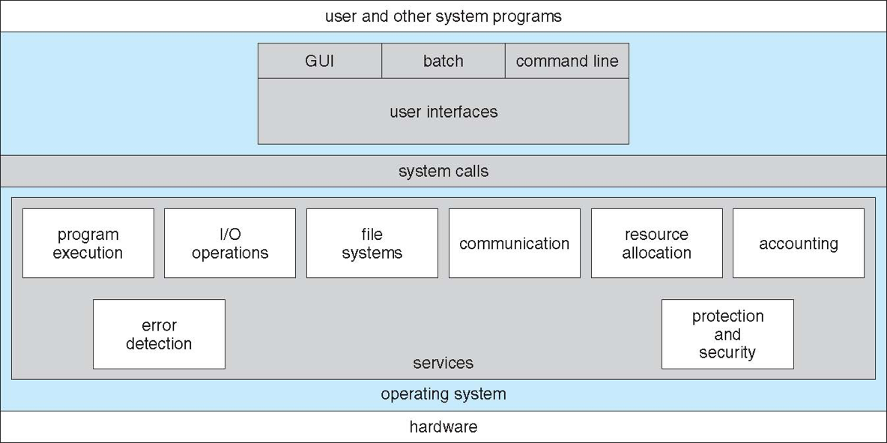

# Operating-System Services

Operating systems provide an **environment** for execution of programs and **services** to programs and users

One set of operating-system services provides functions that are helpful to the user

- **User interface**

  Command-Line (CLI), Graphics User Interface (GUI), Batch

- **Program execution**

  The system must be able to load a program into memory and to run that program, end execution, either normally or abnormally (indicating error)

- **I/O operations**

  A running program may require I/O, which may involve a file or an I/O device

- **File-system manipulation**

  The file system is of particular interest. Programs need to read and write files and directories, create and delete them, search them, list file Information, permission management.

- **Communications**

  Processes may exchange information, on the same computer or between computers over a network

  - shared memory

  - message passing (packets moved by the OS)

- **Error detection**

  Detect and correct erros constantly

  May occur in the CPU and memory hardware, in I/O devices, in user program

  For each type of error, OS should take the appropriate action to ensure correct and consistent computing

  Debugging facilities can greatly enhance the user’s and programmer’s abilities to efficiently use the system

Another set of OS functions exists for ensuring the efficient operation of the system itself via resource sharing

- **Resource allocation**

  When multiple users or multiple jobs running concurrently, resources must be allocated to each of them

  - Many types of resources - CPU cycles, main memory, file storage, I/O devices

- **Accounting**

  To keep track of which users use how much and what kinds of computer resources

- **Protection and security**

  The owners of information stored in a multiuser or networked computer system may want to control use of that information, concurrent processes should not interfere with each other

      - **Protection** involves ensuring that all access to system resources is controlled

      - **Security** of the system from outsiders requires user authentication, extends to defending external I/O devices from invalid access attempts
