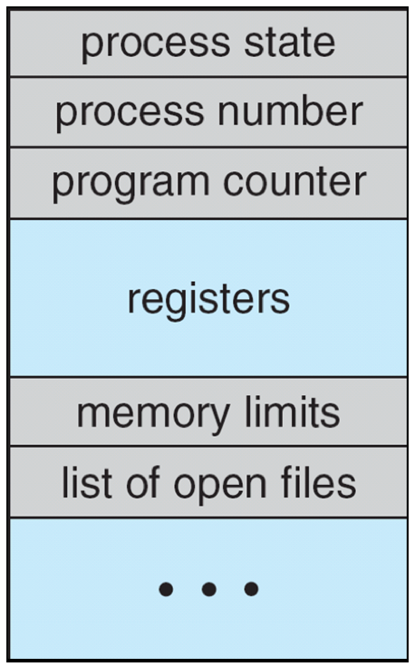
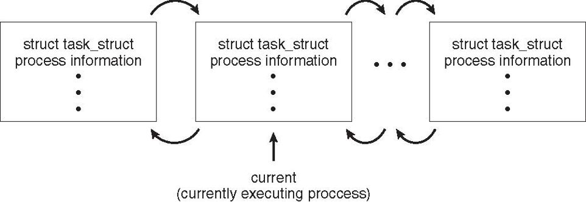

A process is the unit of work in a modern time-sharing system

# Process Concept

An operating system executes a variety of programs

- batch system - **jobs**
- Time-sharing systems - **user programs** or **tasks**
- **job** and **process** almost interchangeably in this text

## The Process

process - a program in execution


### multiple parts

- **text section** - the program code
- Current activity including **program counter**, processor registers
- **Stack** containing temporary data
  - Function parameters, return addresses, local variables
- **Data section** containing global variables
- **Heap** containing memory dynamically allocated during run time

### Program VS Process

Program is **passive** entity stored on disk (executable file), process is **active**

Program becomes process when executable file loaded into memory

Execution of program started via GUI mouse clicks, command line entry of its name, etc

One program can be several processes

- Consider multiple users executing the same program

A process can be an execution environment for other code

- JVM

## Process State

As a process executes, it changes state

- new: The process is being created
- running: Instructions are being executed
- waiting: The process is waiting for some event to occur
- ready: The process is waiting to be assigned to a processor
- terminated: The process has finished execution


<br>

## Process Control Block



Information associated with each process

- Process state – running, waiting, etc
- Program counter – location of next instruction to be executed
- CPU registers – contents of all process-centric registers
- CPU scheduling information - priorities, scheduling queue pointers
- Memory-management information – memory allocated to the process
- Accounting information – CPU used, clock time elapsed since start, time limits
- I/O status information – I/O devices allocated to process, list of open files


<br>

## Threads

Modern operating systems have extended the process concept to allow a process to have multiple threads of execution and thus to perfrom more than one task at a time.

PCB also include information for each thread

## Process Representation in Linux

```c
pid t_pid; /* process identifier */
long state; /* state of the process */
unsigned int time_slice /* scheduling information */
struct task_struct *parent; /* this process’s parent */
struct list_head children; /* this process’s children */
struct files_struct *files; /* list of open files */
struct mm_struct *mm; /* address space of this process */
```

Within the Linux kernel, all active processes are represented using a doubly linked list of task_struct.


<br>

# Process Scheduling

# Operations on Processes

# Interprocess Communication

# Examples of IPC Systems

# Communications in Client-Server Systems
