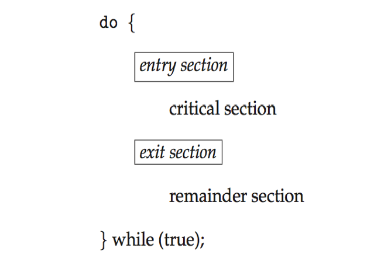
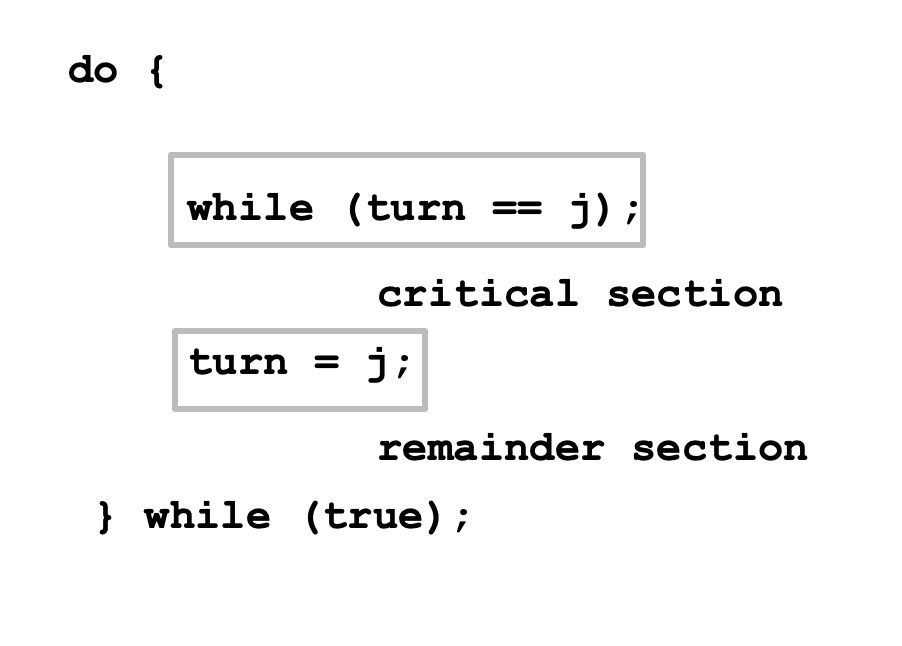
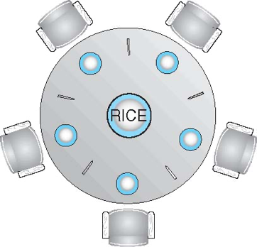
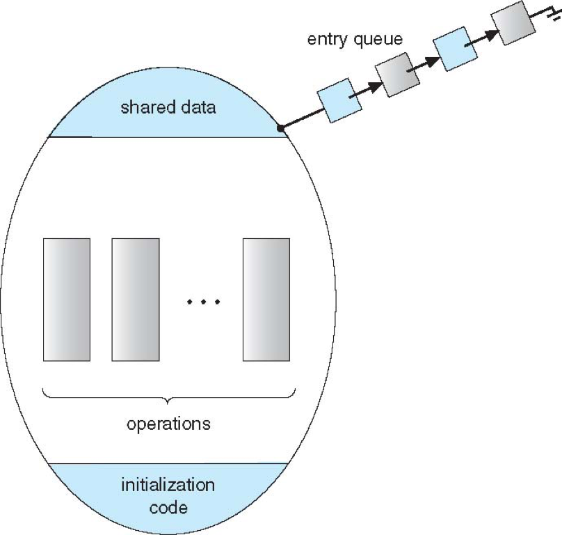

# Background

Processes can execute concurrently

- May be interrupted at any time, partially completing execution

Concurrent access to shared data may result in data inconsistency

Maintaining data consistency requires mechanisms to ensure the orderly execution of cooperating processes

## Illustration of the problem

Suppose that we wanted to provide a solution to the consumer-producer problem that fills all the buffers (**bounded buffer**). We can do so by having an integer counter that keeps track of the number of full buffers.

Initially, counter is set to 0. It is incremented by the producer after it produces a new buffer and is decremented by the consumer after it consumes a buffer.

## Producer

```c
while (true) {	/* produce an item in next produced */

	while (counter == BUFFER_SIZE) ;
		/* do nothing */
	buffer[in] = next_produced;
	in = (in + 1) % BUFFER_SIZE;
	counter++;
}
```

## Consumer

```c
while (true) {
	while (counter == 0)
		; /* do nothing */
	next_consumed = buffer[out];
	out = (out + 1) % BUFFER_SIZE;
        counter--;
	/* consume the item in next consumed */
}
```

#### Above producer and consumer may not funtion correctly when executed concurrently

<br>

## Race Condition

Several processes access and manipulate the same data concurrently and the outcome of the execution depends on particular order in which the access take place
<br>

### counter++ could be implemented as

```c
register1 = counter
register1 = register1 + 1
counter = register1
```

### counter-- could be implemented as

```c
register2 = counter
register2 = register2 - 1
counter = register2
```

### One interleaving example

S0: producer execute register1 = counter (register1 = 5)

S1: producer execute register1 = register1 + 1 (register1 = 6)

S2: consumer execute register2 = counter (register2 = 5)

S3: consumer execute register2 = register2 – 1 (register2 = 4)

S4: producer execute counter = register1 (counter = 6)

S5: consumer execute counter = register2 (counter = 4)
<br>
<br>

# The Critical-Section Problem

Consider system of n processes {_p0, p1, … pn-1_}

Each process has **critical section** segment of code

- Process may be changing common variables, updating table, writing file, etc
- When one process in critical section, no other may be in its critical section

**Critical section problem** is to design protocol to solve this

Each process must ask permission to enter critical section in **entry section**, may follow critical section with **exit section**, then **remainder section**



## Algorithm for Process Pi



## Solution Requirements

1.  **Mutual Exclusion**

    If process Pi is executing in its critical section, then no other processes can be executing in their critical sections

2.  **Progress**

    If no process is executing in its critical section and there exist some processes that wish to enter their critical section, then the selection of the processes that will enter the critical section next cannot be postponed indefinitely

3.  **Bounded Waiting**

    A bound must exist on the number of times that other processes are allowed to enter their critical sections after a process has made a request to enter its critical section and before that request is granted

    - Assume that each process executes at a nonzero speed

    - No assumption concerning relative speed of the n processes

## Critical-Section Handling in OS

Two approaches depending on if kernel is **preemptive** or **non-preemptive**

**Preemptive** – allows preemption of process when running in kernel mode

**Non-preemptive** – runs until exits kernel mode, blocks, or voluntarily yields CPU

- Essentially free of race conditions in kernel mode

<br>
<br>

# Peterson’s Solution

Good algorithmic description of solving the problem

Two process solution

#### The two processes share two variables

```c
int turn;
Boolean flag[2]
```

**turn** - whose turn to enter the critical section

**flag array** - if a process is ready to enter the critical section. flag[i] = true implies that process Pi is ready


### Provable that the three CS requirement are met

1.  Mutual exclusion is preserved
    Pi enters CS only if:
    either flag[j] = false or turn = i
2.  Progress requirement is satisfied
3.  Bounded-waiting requirement is met

<br>
<br>

# Synchronization Hardware

Many systems provide hardware support for implementing the critical section code

All solutions below based on idea of **locking**

- Protecting critical regions via locks

#### Solution to Critical-section Problem Using Locks


<br>

### Uniprocessors

could disable interrupts

- Currently running code would execute without preemption
- Generally too inefficient on multiprocessor systems
  - Message need to pass to every processor
  - Operating systems using this not broadly scalable

Modern machines provide special atomic hardware instructions

- Atomic = non-interruptible
- Either test memory word and set value
- Or swap contents of two memory words

### test_and_set Instruction

```c
    boolean test_and_set (boolean *target)
    {
        boolean rv = *target;
        *target = TRUE;
        return rv:
    }
```

1. Executed atomically
   - two _test_and_set()_ instruction are executed simultaneously (each on a different CPU) will be executed sequentially in some arbitrary order
2. Returns the original value of passed parameter
3. Set the new value of passed parameter to “TRUE”.

### Solution using test_and_set()

Shared Boolean variable lock, initialized to FALSE

```c
    do {
		while (test_and_set(&lock))
            ; /* do nothing */
                /* critical section */
        lock = false;
                /* remainder section */
    } while (true);
```

### compare_and_swap Instruction

```c
    int compare _and_swap(int *value, int expected, int new_value) {
        int temp = *value;

        if (*value == expected)
            *value = new_value;
        return temp;
    }
```

1. Executed atomically
2. Returns the original value of passed parameter “value”
3. Set the variable “value” the value of the passed parameter “new_value” but only if “value” ==“expected”. That is, the swap takes place only under this condition.

### Solution using compare_and_swap

Shared integer “lock” initialized to 0;

```c
    do {
		while (compare_and_swap(&lock, 0, 1) != 0)
            ; /* do nothing */

            /* critical section */
        lock = 0;

            /* remainder section */
    } while (true);
```

### Bounded-waiting Mutual Exclusion with test_and_set

```c
do {
	waiting[i] = true;
	key = true;
	while (waiting[i] && key)
    	key = test_and_set(&lock);
    waiting[i] = false;

    	/* critical section */

    j = (i + 1) % n;
    while ((j != i) && !waiting[j])
      	j = (j + 1) % n;

    if (j == i)
        lock = false;
   else
        waiting[j] = false;

        /* remainder section */
} while (true);
```

<br>
<br>

# Mutex Locks

Previous solutions are complicated and generally inaccessible to application programmers

OS designers build software tools to solve critical section problem

Simplest is mutex lock by protect a critical section by first acquire() a lock then release() the lock

### Solution to critical-section problem using mutex locks

```c
do {
	acquire lock
		critical section
	release lock
		remainder section
} while (true);
```

Calls to acquire() and release() must be atomic

- Usually implemented via hardware atomic instructions

### acquire() and release()

```c
acquire() {
	while (!available)
        ; /* busy wait */
    available = false;;
}
```

```c
release() {
	available = true;
}
```

But this solution requires busy waiting

- This lock therefore called a spinlock
  <br>
  <br>

# Semaphore

Synchronization tool that provides more sophisticated ways (than Mutex locks) for process to synchronize their activities.

Semaphore **S** – integer variable

Can only be accessed via two indivisible (atomic) operations

- wait() and signal()
  - Originally called **P()** and **V()**

Definition of the **wait() operation**

```c
wait(S) {
	while (S <= 0)
		; // busy wait
	S--;
}
```

Definition of the **signal() operation**

```c
signal(S) {
	S++;
}
```

## Semaphore Usage

**Counting semaphore** – integer value can range over an unrestricted domain

- initialize to the number of resources available

**Binary semaphore** – integer value can range only between 0 and 1

- Same as a mutex lock

#### Can solve various synchronization problems

Consider **P1** and **P2** that require **S1** to happen before **S2**

Create a semaphore “synch” initialized to 0

```c
P1:
   S1;
   signal(synch);
P2:
   wait(synch);
   S2;

```

Can implement a counting semaphore **S** as a binary semaphore
<br>

## Semaphore Implementation

### Basic

Must guarantee that no two processes can execute the **wait()** and **signal()** on the same semaphore at the same time

Thus, the implementation becomes the critical section problem where the **wait** and **signal** code are placed in the critical section

- Could now have busy waiting in critical section implementation
  - But implementation code is short
  - Little busy waiting if critical section rarely occupied

Note that applications may spend lots of time in critical sections and therefore this is not a good solution

### With no busy waiting

With each semaphore there is an associated waiting queue

Each entry in a waiting queue has two data items:

1. value (of type integer)
2. pointer to next record in the list
   <br>

#### Semaphore structure

```c
typedef struct{
	int value;
	struct process *list; // can be PCBs
} semaphore;
```

#### Two operations

1. **block** – place the process invoking the operation on the appropriate waiting queue

2. **wakeup** – remove one of processes in the waiting queue and place it in the ready queue

```c
wait(semaphore *S) {
   S->value--;
   if (S->value < 0) {
	   add this process to S->list;
       block();
   }
}

signal(semaphore *S) {
   S->value++;
   if (S->value <= 0) {
	   remove a process P from S->list;
       wakeup(P);
   }
}
```

block() and wakeup() are provided by the operating system as basic system calls

SMP systems must provide alternative locking techniques - such as c**ompare_and_swap()** or spinlocks - to ensure that **wait()** and **signal()** are performed atomically

We not completely eliminated busy waiting with this definition of the wait() and signal() operations. Rather, we have moved busy waiting from the entry section to the critical sections of application programs
<br>

## Deadlock and Starvation

#### Deadlock

two or more processes are waiting indefinitely for an event that can be caused by only one of the waiting processes

Let S and Q be two semaphores initialized to 1

<table>
	<thead>
	<tr>
	<th>P0</th>
	<th>P1</th>
	</tr>
	</thead>
	<tbody>
	<tr>
	<td>wait(S);</td>
	<td>wait(Q);</td>
	</tr>
	<tr>
	<td>wait(Q);</td>
	<td>wait(S);</td>
	</tr>
	</tr>
	<tr>
	<td>...</td>
	<td>...</td>
	</tr>
	<tr>
	<td>signal(S);</td>
	<td>signal(Q);</td>
	</tr>
	<tr>
	<td>signal(Q);</td>
	<td>signal(S);</td>
	</tr>
	</tbody>
</table>
<br>

#### Starvation – indefinite blocking

A process may never be removed from the semaphore queue in which it is suspended

## Priority Inversion

Scheduling problem when lower-priority process holds a lock needed by higher-priority process

Solved via **priority-inheritance protocol**
<br>
<br>

# Classical Problems of Synchronization

Classical problems used to test newly-proposed synchronization schemes

- Bounded-Buffer Problem
- Readers and Writers Problem
- Dining-Philosophers Problem

<br>

## Bounded-Buffer Problem

n buffers, each can hold one item

Semaphore mutex initialized to the value 1

Semaphore full initialized to the value 0

Semaphore empty initialized to the value n

### producer process

```c
    do {
           ...
		/* produce an item in next_produced */
           ...
        wait(empty);
        wait(mutex);
           ...
		/* add next produced to the buffer */
           ...
        signal(mutex);
        signal(full);
     } while (true);
```

### consumer process

```c
    do {
        wait(full);
        wait(mutex);
           ...
		/* remove an item from buffer to next_consumed */
           ...
        signal(mutex);
        signal(empty);
           ...
		/* consume the item in next consumed */
           ...
	} while (true);
```

<br>

## Readers-Writers Problem

A data set is shared among a number of concurrent processes

- Readers – only read the data set; they do not perform any updates

- Writers – can both read and write

Problem – allow multiple readers to read at the same time

- Only one single writer can access the shared data at the same time

### Readers-Writers Problem Variations

Both may have starvation leading to even more variations

Problem is solved on some systems by kernel providing reader-writer locks

#### first reader-writers problem

no reader be kept waiting unless a writer has already obtained perission to use the shared object

#### second reader-writers problem

once a writer is ready, what writer perform its write as soon as possible

### solution to first reader-writers problem

Shared Data

```c
semaphore rw_mutex = 1;
semaphore mutex = 1; // ensure mutual exclusion when the variable read_count is updated
int read_count = 0;
```

#### writer process

```c
    do {
		wait(rw_mutex);
            ...
		/* writing is performed */
            ...
        signal(rw_mutex);
    } while (true);
```

#### reader process

```c
    do {
		wait(mutex);
		read_count++;
		if (read_count == 1)
            wait(rw_mutex);
        signal(mutex);
            ...
		/* reading is performed */
               ...
        wait(mutex);
		read count--;
		if (read_count == 0)
           signal(rw_mutex);
        signal(mutex);
    } while (true);
```

Reader - writer locks are most useful in the following situations:

1. It is easy tp identify which processes only read shared data and which processes only write sahred data

2. Have more readers than writers

<br>

## Dining-Philosophers Problem



### In the case of 5 philosophers

Shared data

- Bowl of rice (data set)
- Semaphore chopstick [5] initialized to 1

#### The structure of Philosopher i:

```c
do {
    wait (chopstick[i] );
	wait (chopStick[ (i + 1) % 5] );
		...
	/* eat for a while */

	signal (chopstick[i] );
	signal (chopstick[ (i + 1) % 5] );
		...
    /* think for a while */

} while (true);
```

### Deadlock handling

1. Allow at most 4 philosophers to be sitting simultaneously at the table.

2. Allow a philosopher to pick up the forks only if both are available (picking must be done in a critical section.

3. Use an asymmetric solution -- an odd-numbered philosopher picks up first the left chopstick and then the right chopstick. Even-numbered philosopher picks up first the right chopstick and then the left chopstick.

<br>
<br>

# Monitors

A high-level abstraction that provides a convenient and effective mechanism for process synchronization

## Monitor Usage

**_Abstract data type_**, internal variables only accessible by code within the procedure

Only one process may be active within the monitor at a time

But not powerful enough to model some synchronization schemes

```c
monitor monitor-name
{
	// shared variable declarations
	procedure P1 (…) { … }
		.
		.
		.
	procedure Pn (…) {……}

    Initialization code (…) { … }
}
```


<br>

### Condition Variables

Two operations are allowed on a condition variable:
**x.wait()** – a process that invokes the operation is suspended until x.signal()

**x.signal()** – resumes one of processes (if any) that invoked x.wait()
If no x.wait() on the variable, then it has no effect on the variable


### Condition Variables Choices

If process P invokes x.signal(), and process Q is suspended in x.wait(), what should happen next?

- Both Q and P cannot execute in paralle. If Q is resumed, then P must wait

#### Options

1. **Signal and wait** - P waits until Q either leaves the monitor or it waits for another condition

2. **Signal and continue** – Q waits until P either leaves the monitor or it waits for another condition

Both have pros and cons – language implementer can decide

Monitors implemented in Concurrent Pascal compromise

- P executing signal immediately leaves the monitor, Q is resumed

<br>

## Monitor Solution to Dining Philosophers

### Restriction

A philosopher may pick up her chopsticks only if both of them are available.

### state of philosophers

```c
monitor DiningPhilosophers
{
	enum { THINKING; HUNGRY, EATING) state [5] ;
	condition self [5];

	void pickup (int i) {
	    state[i] = HUNGRY;
	    test(i);
	    if (state[i] != EATING) self[i].wait;
    }

    void putdown (int i) {
	    state[i] = THINKING;
	    test((i + 4) % 5);
	    test((i + 1) % 5);
    }

   	void test (int i) {
	    if ((state[(i + 4) % 5] != EATING) &&
	     (state[i] == HUNGRY) &&
	     (state[(i + 1) % 5] != EATING) ) {
	        state[i] = EATING ;
		    self[i].signal () ;
	    }
    }

    initialization_code() {
	    for (int i = 0; i < 5; i++)
	       state[i] = THINKING;
	}
}
```

Each philosopher i invokes the operations **pickup()** and **putdown()** in the following sequence:

```c
    DiningPhilosophers.pickup(i);
			...
            eat
			...
    DiningPhilosophers.putdown(i);
```

No deadlock, but starvation is possible

<br>

## Monitor Implementation Using Semaphores

### Variables

```c
	semaphore mutex;  // (initially  = 1)
	semaphore next;   // (initially  = 0)
	int next_count = 0;
```

introduce next because: a signaling process must wait until the resumed process either leaves or wait

Each procedure F will be replaced by

```c
	wait(mutex);
		…
        body of F;
		…
	if (next_count > 0)
		signal(next)
	else
		signal(mutex);
```

Mutual exclusion within a monitor is ensured

### Condition Variables

For each condition variable x, we have:

```c
	semaphore x_sem; // (initially  = 0)
	int x_count = 0;
```

The operation x.wait can be implemented as:

```c
	x_count++;
	if (next_count > 0)
		signal(next);
	else
		signal(mutex);
	wait(x_sem);
	x_count--;
```

The operation x.signal can be implemented as:

```c
	if (x_count > 0) {
		next_count++;
		signal(x_sem);
		wait(next);
		next_count--;
	}
```

## Resuming Processes within a Monitor

If several processes queued on condition x, and x.signal() executed, which should be resumed?

FCFS frequently not adequate

**conditional-wait** construct of the form x.wait(c)

- Where c is priority number
- Process with lowest number (highest priority) is scheduled next

### Single Resource allocation

Allocate a single resource among competing processes using priority numbers that specify the maximum time a process plans to use the resource

```c
    R.acquire(t);
        ...
    access the resurce;
        ...

    R.release;
```

Where R is an instance of type ResourceAllocator
